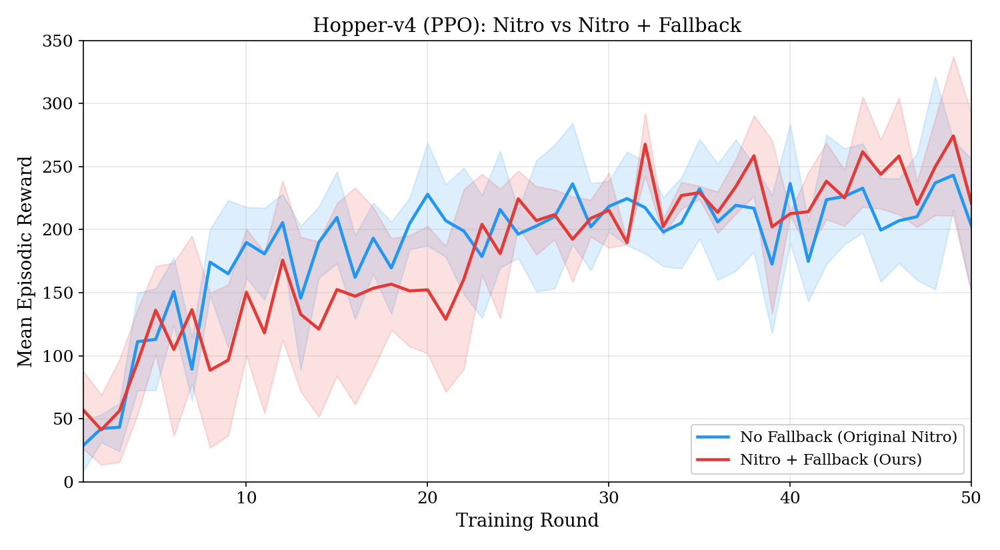
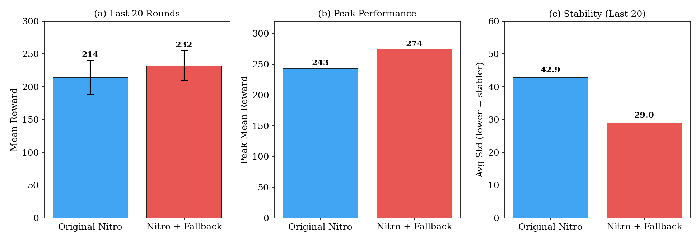
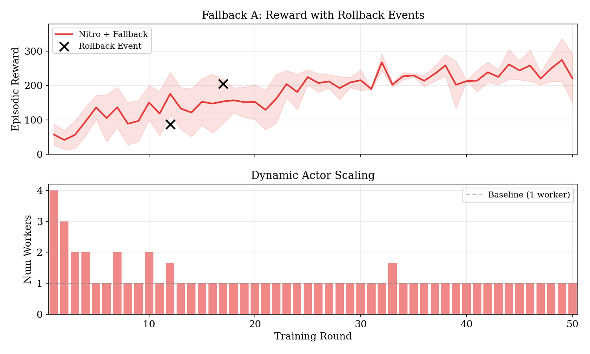

# Nitro with Fallback: Post-Boost Rollback for Distributed RL

This project extends [Nitro](https://github.com/IntelliSys-Lab/Nitro-VLDB25) (VLDB 2025) with a **post-boost fallback mechanism** that detects and reverses ineffective actor scaling decisions, improving training quality by 8.3% and reducing variance by 32%.

## Background

Nitro is a distributed RL training engine that uses Hessian-based convexity detection to dynamically scale serverless actors (AWS Lambda). When the loss surface is flat, Nitro "boosts" by launching more actors to diversify trajectory sampling.

**Problem:** Our experiments show that Nitro's Hessian-based detection has **near-zero correlation** (Spearman = -0.022) with actual boosting effectiveness. Boosts at wrong rounds can degrade policy quality, with reward drops of up to 34 points observed.

**Solution:** We introduce a discounted reward observation window that evaluates each boost's effectiveness over 5 subsequent rounds. If the boost is detected to be harmful, the policy weights are rolled back to the pre-boost checkpoint.

## Results

### Reward Comparison (Hopper-v4, PPO, 50 rounds)



*Nitro + Fallback (red) overtakes the original Nitro (blue) after Round 25 and maintains higher reward with lower variance.*

### Performance Summary



| Metric | Original Nitro | Nitro + Fallback | Improvement |
|--------|:-:|:-:|:-:|
| Mean Reward (last 20 rounds) | 214.4 | **232.2** | **+8.3%** |
| Peak Reward | 243.2 | **274.3** | **+12.8%** |
| Stability (std, lower=better) | 42.9 | **29.0** | **-32.4%** |
| Statistical significance | — | t=+2.61, **p<0.05** | |

### Stability Analysis

Fallback A wins on **all 10 stability metrics**:

| Metric | Original Nitro | Nitro + Fallback | Improvement |
|--------|:-:|:-:|:-:|
| Seed-to-seed std (last 20) | 25.9 | **22.9** | -11% |
| Round-to-round volatility \|Δr\| | 48.0 | **37.7** | **-21%** |
| Round-to-round volatility (last 20) | 49.4 | **36.2** | **-27%** |
| Mean max drawdown | 162.2 | **143.3** | -12% |
| Worst-seed max drawdown | 184.8 | **175.6** | -5% |
| Trend consistency R² (higher=better) | 0.331 | **0.564** | **+70%** |
| Reward slope (reward/round) | 2.45 | **3.68** | **+50%** |
| Drop-below-200 rate after reaching 200 | 41.7% | **26.2%** | **-37%** |
| Coefficient of variation (last 20) | 0.201 | **0.123** | **-39%** |
| Per-round improvement probability | 49.0% | **58.5%** | **+19%** |

Key findings:
- **Trend R² improves 70%** (0.33 to 0.56): reward curve is much closer to a stable upward trend
- **Drop-below rate decreases 37%**: once reaching 200, Fallback A maintains it 74% of the time vs 58%
- **Per-round improvement probability rises from 49% to 58.5%**: more rounds make positive progress

### Rollback Behavior



*Rollback events (x markers) concentrate in early training rounds when the Hessian detector is least reliable. After the adaptive decay kicks in, the system becomes more conservative and rollbacks become rare.*

## How It Works

### Fallback Mechanism

```
Round k: Hessian detects boost opportunity, boost_score is high
  |
  +-- Save policy weights checkpoint
  +-- Increase actors (e.g., 1 -> 4)
  |
Rounds k to k+4: Observation window
  |
  +-- Collect rewards: [r_k, r_{k+1}, r_{k+2}, r_{k+3}, r_{k+4}]
  +-- Compute discounted reward: G = r_k + 0.9*r_{k+1} + 0.81*r_{k+2} + ...
  +-- Compare with baseline: G_baseline = r_{k-1} * (1 + 0.9 + 0.81 + ...)
  |
Round k+4: Decision
  |
  +-- G >= G_baseline: Boost was effective, continue normally
  +-- G <  G_baseline: Boost failed!
        +-- Rollback policy weights to pre-boost checkpoint
        +-- Force next round's boost_score = 0 (conservative)
        +-- Reduce future boost aggressiveness (decay *= 0.9)
```

### Key Parameters

| Parameter | Value | Description |
|-----------|-------|-------------|
| Window size | 5 rounds | Observation period after boost |
| Discount factor (gamma) | 0.9 | Weight for reward window |
| Decay penalty | 0.9 | Multiplied per rollback to reduce future boosts |

## Architecture

This project uses a **local simulation** of Nitro's serverless architecture for HPC clusters:

```
Original Nitro (AWS):
  Learner (EC2 GPU) --> Lambda instances --> Redis --> trainer.train()

Local Simulation:
  Learner (GPU node) --> multiprocessing.Process(spawn) --> Redis --> trainer.train()
```

The scheduling logic (Hessian detection, boost score, dynamic scaling) is **identical** to the original Nitro. Only the actor execution backend differs.

## Project Structure

```
Nitro_with_fallback/
  |-- run_multi_seed.py        # Main experiment runner (fallback logic here)
  |-- Nitro_local.py           # Local simulation entry point
  |-- local_actor.py           # Local process-based actor (replaces Lambda)
  |-- env.py                   # Training environment with local simulation support
  |-- config.py                # Configuration (environment, scheduling, fallback)
  |-- utils.py                 # Hessian evaluation, GNS, CSV export
  |-- pyhessian/               # Hessian eigenvalue computation (PyHessian)
  |-- Nitro.py                 # Original Nitro (reference)
  |-- serverful_baseline.py    # Serverful baseline (reference)
  |-- aws_lambda/              # Original Lambda actor code (reference)
  |-- plot_fallback_a_vs_baseline.py  # Generate comparison plots
  |-- plots/                   # Generated figures
  |-- logs/multi_seed/         # Experiment CSV data
  |-- requirements.txt         # Python dependencies
```

### Core Fallback Code

The fallback logic is in `run_multi_seed.py`, lines 96-144:

```python
# Save checkpoint at boost start (line 97-103)
if is_boosted and pending_boost is None:
    pending_boost = {
        "pre_boost_state": copy.deepcopy(env.get_policy_state()),
        "baseline_reward": prev_reward,
        "window_rewards": [],
    }

# Collect rewards and evaluate (line 126-144)
pending_boost["window_rewards"].append(reward)
if len(pending_boost["window_rewards"]) >= FB_WINDOW:
    G_actual = compute_discounted_reward(window_rewards, gamma=0.9)
    G_baseline = compute_baseline_expected(baseline_reward, window=5, gamma=0.9)
    if G_actual < G_baseline:
        env.set_policy_state(pending_boost["pre_boost_state"])  # ROLLBACK
```

## Quick Start

### Prerequisites

- Python 3.10+
- GPU (tested on NVIDIA V100)
- Redis server

### Installation

```bash
pip install torch gymnasium[mujoco]>=1.0 mujoco ray[rllib]==2.8 redis pandas
```

Note: This project requires a [custom Ray fork](https://github.com/IntelliSys-Lab/Nitro-ray) with PPOServerless support. See the original [Nitro repo](https://github.com/IntelliSys-Lab/Nitro-VLDB25) for setup instructions.

### Run Experiments

```bash
# Start Redis
redis-server --port 6379 --requirepass Nitro --daemonize yes

# Run Fallback A vs No Fallback (3 seeds each)
python run_multi_seed.py --seeds 3 --mode fallback_A
python run_multi_seed.py --seeds 3 --mode no_fallback

# Generate comparison plots
python plot_fallback_a_vs_baseline.py
```


## References

- **Nitro**: Yu et al., "Nitro: Boosting Distributed Reinforcement Learning with Serverless Computing", PVLDB 18(1), 2024. [Paper](https://doi.org/10.14778/3696435.3696441) | [Code](https://github.com/IntelliSys-Lab/Nitro-VLDB25)
- **PyHessian**: Yao et al., "PyHessian: Neural Networks Through the Lens of the Hessian", 2020.
- **PPO**: Schulman et al., "Proximal Policy Optimization Algorithms", 2017.

## License

This project builds on Nitro (CC BY-NC-ND 4.0). See the [original license](https://github.com/IntelliSys-Lab/Nitro-VLDB25).
